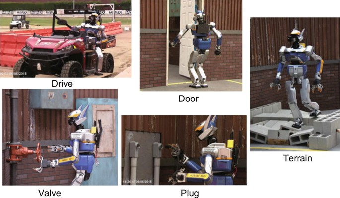
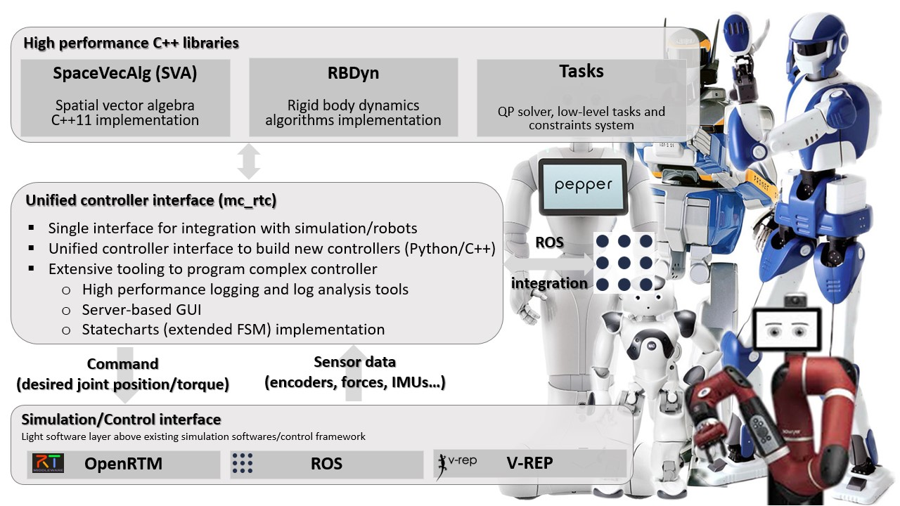
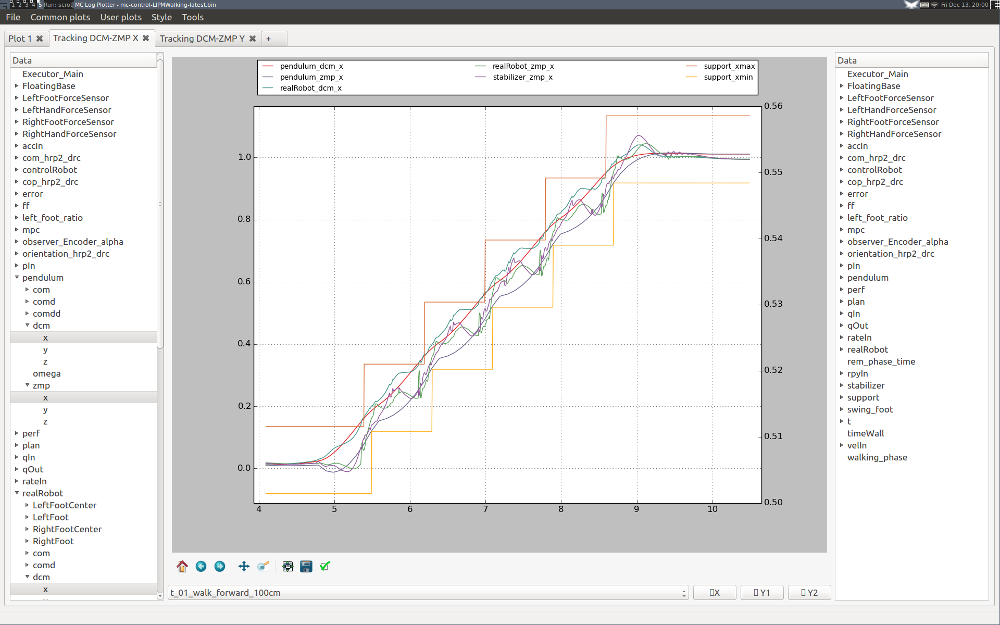
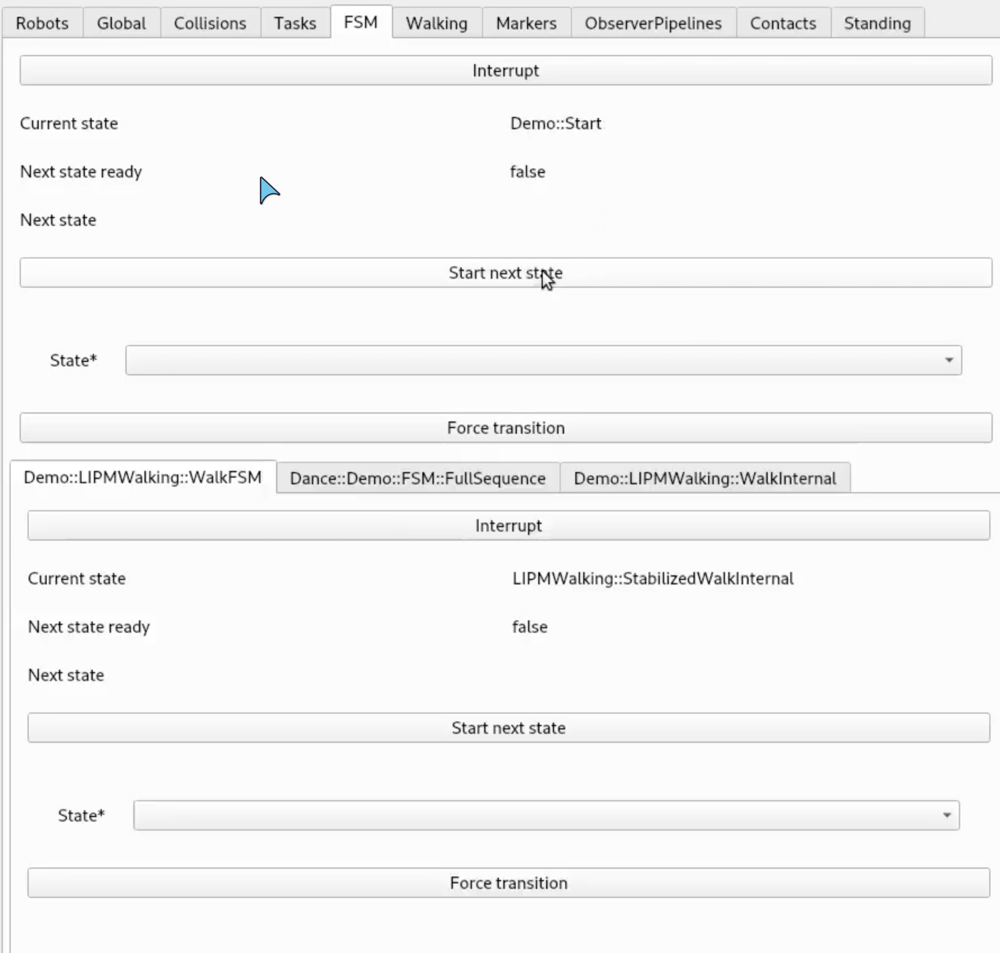
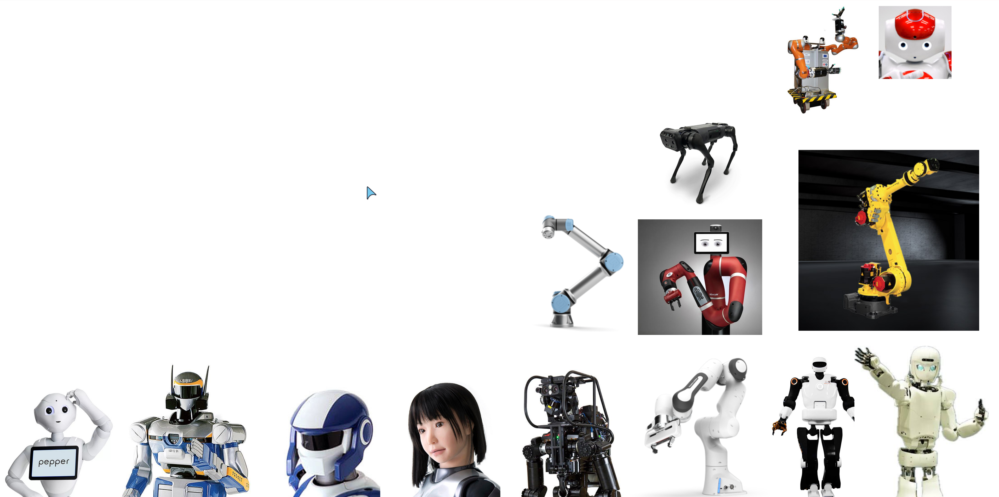

---
# Metadata
title: Evolution of software frameworks and build-system of LIRMM/JRL-AIST and buildsystems
date: 2026-06-04
author: Arnaud Tanguy 
affiliation: https://github.com/arntanguy
lang: en-US

# Marp config
theme: custom-theme
paginate: false
# Transitions documentation: https://github.com/marp-team/marp-cli/blob/v4.3.1/docs/bespoke-transitions/README.md
transition: coverflow
header: Retrospective and evolution of LIRMM/JRL control software and build systems
footer: |
  Tech Days 2026 - Retrospective and evolution of LIRMM/JRL control software and build systems
---

<style scoped>
  h1 a {
    color: inherit;
    text-decoration: underline;
  }
</style>

<!--
_class: lead
_paginate: false
_header: ""
_footer: ""
-->

# Retrospective and evolution of LIRMM/JRL control software and build systems

## Arnaud Tanguy - Research Engineer - LIRMM

**LIRMM**: Laboratoire d'informatique et de robotique de l'université de Montpellier

---

<!-- _transition: none -->
<!-- header: Who am I? -->

# Who am I?
## [Arnaud Tanguy](https://arntanguy.fr/)

- Research engineer since 2018 with focus on humanoid robotics and background in computer vision
- I care about:
  - Empowering researchers to succeed in their projects
  - Making science reprocucible
> Any problem should only be hard to solve once

---

## Background

- **2011-2014**: Software Engineer Degree with major in computer vision (*Polytech'Nice-Sophia-Antipolis*)
  - 1 year in Trinity College Dublin: master's in interactive entertainment technology
  - Project with *Andrew Comport*: visualizing a dense visual SLAM map with augmented reality headset
  - 6 months internship at TUM Munich in Daniel Cremer's team
    - Siamese Neural Network for loop closure detection of Visual SLAM

---

## Background

- **2014-2018**: **Thesis** - Visual SLAM for humanoid localization and closed-loop control 
  - **Supervisors**: Andrew Comport and Abderrahmane Kheddar
  - [I3S](https://www.i3s.unice.fr) *Sophia-Antipolis*, [LIRMM](https://www.lirmm.fr) (*Laboratoire d'informatique et de robotique de l'université de Montpellier*), [JRL-AIST](https://jrl.cnrs.fr) (*Joint Robotics Laboratory - Advanced Institute of Science and Technology - Tsukuba, Japan*)
- **2019**: Research Engineer@LIRMM
- **2020-2022**: Research Engineer@JRL-AIST, Japan
- **2022-2026**: Research engineer@LIRMM

---

## Main projects

- **DARPA Robotics Challenge** - *Team AIST-NEDO* - *2015*
  - International challenge on disaster scenario response
- [**COMANOID**](https://cordis.europa.eu/project/id/645097): *2015-2019*
  - Multi-Contact Collaborative Humanoids in Aircraft Manufacturing
- [**ANA Avatar XPrize**](https://www.xprize.org/competitions/avatar) - *Team Janus* - *2023*
  - Humanoid avatar
- **Locomanipulation of large industrial objects** - *2020-2023*
- **Rolkneematics** - *2024-now* - Robotics Learning of Knee Implants Real-Time Imagery

---
<!-- header: Objective -->

## Objective of this talk

- Presentation of the software stack used across most projects
  - `mc_rtc` and its dependencies
- Evolution of build systems
  - `cmake` `jrl-cmakemodules` `cmake + shell` `mc-rtc-superbuild` `nix`
- Towards reproducibility of software and demos
  - `devcontainers`, `nix`, `ci`
- Perspectives: how can we do more together?
  - reduce amount of duplicated dependencies
  - converge on common software development and packaging practices

---

<!-- header: Software stack evolution -->

## Context 

- **JRL-AIST**: Joint research lab (since 2018) between
  - **LIRMM**: Interactive Digital Human Team (IDH)
    - Led by Abderrahmane Kheddar > Sofiane Ramadi
  - **AIST**: Humanoid Research Group (HRG)
    - Led by Fumio Kanehiro
- Shared robots:
  - HRP-4 in LIRMM
  - HRP robots family with HRG group (`HRP-4J`, `HRP4-CR`, `HRP-2Kai`, `HRP-5P`)
  - More recently Kawasaki's `RHPS1`

---

## Research topics (~2012)

- Multi-robot QP control methods
  - Karim Bouyarmane, Joris Vaillant, Abderrahmane Kheddar
  - [Thesis Joris Vaillant](https://theses.fr/2015MONTS065) (2015): *Programmation de mouvements de locomotion et manipulation pour robots humanoïdes et expérimentations*
- Multi-contact planning
  - Adrien Escande, Stanislas Brossette

---

### Related software development

- [`SpaceVecAlg`](https://github.com/jrl-umi3218/SpaceVecAlg) implementation of Roy Featherstone's spatial vector algebra
- [`RBDyn`](https://github.com/jrl-umi3218/RBDyn) rigid body dynamics algorithms
- [`Tasks`](https://github.com/jrl-umi3218/Tasks) multi-robot QP control

Implemented in `C++`, with `Python bindings`

- Multi-contact planning tools and algorihms
- Communication bridge with HRP robots 

---

### But no formalized ecosystem 

- Projects / demos / use-cases multiply
- No formalized methodology -> everyone implements ad-hoc python code
- Little to no code re-usability outside of the core dependencies (`SpaceVecAlg`, `RBDyn`, ...)
- Ad-hoc use of simulators
- No continuous integration

---

<!-- header: DARPA Robotics Challenge -->

## DARPA Robotics Challenge - 2013-2015

Challenge following Fukushima nuclear reactor meltdown:
- First virtual round: June 2013 > AIST
- Finals: June 2015 > AIST and JRL
- **8 challenging tasks**:
  - *LIRMM/JRL*: `driving`, `egressing the car`
  - *HRG (AIST)*: `opening door`, `valve opening`, `hole drilling`, `cable unplugging`, `debris field crossing`, `stair climbing`

---

## DARPA Robotics Challenge

- **HRG** has `hrpsys` and `hmc2`
  - Very good at walking, manipulation is difficult
  - Strong coupling with `choreonoid` and `openrtm-aist` (ros-like middleware)
  - Graph based, and hard to manage and understand
- **LIRMM/JRL**
  - Very good real-time multi-contact control algorithms (e.g `Tasks`)
  - No unified framework yet

---

## DARPA Robotics Challenge - Inception of `mc_rtc`

We (LIRMM/JRL) need a real-time control software with the following constraints:
- Control must be computed at `1000Hz`
- Can be run on the robot -> `openrtm component`
- Multi-contact planning and qp control -> `SpaceVecAlg`/`RBDyn`/`Tasks`
- Can run multiple control scenarios (ladder climbing, driving, etc)
- Finite State Machine

> Same challenge, two software stacks

---

## Finalist

- Finish 10/23
- 4/6 tasks completed



---

## But... 

<center>
<video src="./assets/drc_hrp2_fail.mp4" autoplay loop muted height="100%"></video>
</center>

---


## Lessons learned

- Don't divide by zero!
- Continuous Integration matters
- Manual deployement processes
- Perception is a challenge
- Control needs more reactivity


---
<!-- header: Control framework: mc_rtc -->

# Control framework: mc_rtc



---

<!-- header: Control framework: mc_rtc - Extensibility -->
## We love extensibility

- Designed around plugins:
  - Controllers
  - Robots
  - FSM States
  - Plugins

Easily extensible:
- Robot and simulator interfaces

---

<!-- header: Control framework: mc_rtc - Logging -->
## We love [Logging](https://jrl.cnrs.fr/mc_rtc/tutorials/usage/logging.html)

```cpp
logger().addLogEntry("entry_name", [this]() { /* compute, say x; */ return x; });
```

- Efficient binary logging with [MessagePack](https://msgpack.org)
- Can log any type supported by the framework (numerical types, arrays, matrices, `spacevecalg`, etc)
- Easy to extend to new types
- Custom interactive GUI to display logs
- Somewhat redundant with [DataTamer](https://github.com/PickNikRobotics/data_tamer) / [PlotJuggler](https://github.com/PlotJuggler/PlotJuggler)

---

## We love [Logging](https://jrl.cnrs.fr/mc_rtc/tutorials/usage/logging.html)



---


<!-- header: Control framework: mc_rtc - GUI -->


## We love [GUI](https://jrl.cnrs.fr/mc_rtc/tutorials/usage/gui.html)

GUI is implemented as a client-server

### Adding elements to the GUI

```cpp
using namespace mc_rtc::gui;
gui().addElement(
  {"Category", "Sub-category"},
    NumberInput("gain",
      []() { return gain_; },
      [](double newGain) { 
        gain_ = newGain; 
      })
);
```
---

## We love [GUI](https://jrl.cnrs.fr/mc_rtc/tutorials/usage/gui.html)

<iframe width="560" height="315" src="https://www.youtube.com/embed/t7_CbzjKDQg?si=hlVMWRDDObxPDK4m" title="YouTube video player" frameborder="0" allow="accelerometer; autoplay; clipboard-write; encrypted-media; gyroscope; picture-in-picture; web-share" referrerpolicy="strict-origin-when-cross-origin" allowfullscreen></iframe>

---

<!-- header: Control framework: mc_rtc - Configuration -->
## We love [Configuration](https://jrl.cnrs.fr/mc_rtc/tutorials/usage/mc_rtc_configuration.html)

- `mc_rtc::Configuration` provides an abstraction over a JSON/YAML to easily manipulate the object and retrieve C++/Python data from it.

```cpp
auto config = mc_rtc::Configuration("myfile.yaml");
Eigen::Vector3d v = config("MyVector3d"); // strict access
bool b = config("MyBool", false); // with default value
std::vector<std::string> v = config("section")("sub1")("sub2")("SomeStrings"); // nested elements
// optional entry
std::vector<double> v = {1., 2., 3.};
config("MyVector", v); // if MyVector is a valid entry, the initial content of v is lost
```

- Specialized for all types supported by the framework

---

## We love [Configuration](https://jrl.cnrs.fr/mc_rtc/tutorials/usage/mc_rtc_configuration.html)

Easily add your own types:

```cpp
template<>
struct ConfigurationLoader<MyType>
{
  static MyType load(const mc_rtc::Configuration & config);

  static mc_rtc::Configuration save(const MyType & object);
};
```

---


<!-- header: Control framework: mc_rtc - Robot Modules -->

<!-- TODO make background transparent -->
<!--  -->

## We love [robots](https://jrl.cnrs.fr/mc_rtc/tutorials/advanced/new-robot.html)

### Robot module

`C++` or `YAML` description that defines:
- how to find the robot's model (urdf, ...)
- additional properties needed by simulators/real robots, e.g:
  - reference joint order
  - default self-collision pairs
  - `PD` gains
- More than 20 robots supported
  - Multiple middleware: `ROS`, `openrtm`, `libfranka`, etc

---


<!-- header: Control framework: mc_rtc - FSM Controllers -->
## We love [FSM Controllers](https://jrl.cnrs.fr/mc_rtc/tutorials/recipes/fsm-example.html)

Getting started with templates:
```sh
mc_rtc_new_fsm_controller my_first_fsm_controller FSMController
```

File | Description
---|---
`etc/FSMController.yaml`|Your controller's FSM configuration file.
`src/FSMController.[h,cpp]`|Controller implementation (C++ or Python)
`src/states/`|Defines the controller's states (C++, Python or YAML)
`src/states/data`|YAML configuration for states
...|...


---

<!-- header: Control framework: mc_rtc - An FSM Controller is: -->

# An [FSM Controllers](https://jrl.cnrs.fr/mc_rtc/tutorials/recipes/fsm-example.html) is
### A `yaml` configuration

```yaml
robots:
  ground:
    module: env/door
states:
  Door_Initial: {} 
  TurnHandle: {}
transitions: 
  - [Door_Initial, OpenDoor, TurnHandle]
```

`...`

---

### `C++` states 

```cpp
struct Door_Initial : public State
{
  void configure(mc_rtc::Configuration &) override;
  void start(Controller &) override;
  bool run(Controller &) override;
  void teardown(Controller &) override;
};
```

`...`

---

### `C++` states 

```cpp
#include <mc_control/fsm/Controller.h>
#include "Door_Initial.h"

void Door_Initial::start(mc_control::fsm::Controller & ctl)
{
  // Add GUI button to open door
  ctl.gui()->addElement({}, mc_rtc::gui::Button("Open door", [this]() { openDoor_ = true; }));
}

bool Door_Initial::run(mc_control::fsm::Controller &)
{
  if(openDoor_)
  {
    output("OpenDoor"); // transition map output
    return true; // can move to next state
  }
  return false;
}


void Door_Initial::configure(const mc_rtc::Configuration &) {}
void Door_Initial::teardown(mc_control::fsm::Controller &) {}
EXPORT_SINGLE_STATE("Door_Initial", Door_Initial)
```

---

### `YAML` State Configurations

```yaml
Door::ReachHandle: # state name
  base: MetaTasks # base c++ state or yaml state, this state adds tasks to a QP solver
  tasks:
    RightHandTrajectory:
      type: surfaceTransform
      surface: RightGripper
      weight: 1000
      stiffness: 5
      targetSurface: # Target relative to the door's handle surface
        robot: door
        surface: Handle
        offset_translation: [0, 0, -0.025]
      completion:
        AND:
          - eval: 0.05
          - speed: 1e-4
```

---

### A `transition map`

```yaml
Door::OpenDoorFSM:
  base: Meta
  transitions:
    - [Door_Initial, OpenDoor, Door::ReachHandle, Auto]
    - [Door::ReachHandle, OK, Door::MoveHandle, Auto]
    - [Door::MoveHandle, OK, Door::OpenDoor, Auto]
```

---

<!-- header: Control framework: mc_rtc - Plugins -->
## We love external tools

Inherit from `mc_control::GlobalPlugin` and implement:

Plugin function|Description
---|---
`init()`|called by mc_rtc when the controller is initialized
`reset()`|called by mc_rtc when the controller is changed
`before()`|called by mc_rtc at the beginning of the run function
`after()`|called by mc_rtc at the end of the run function

Link against any external library and do what you need.

---

<!-- header: Control framework: mc_rtc - State Observation -->
## We love knowing where we are
### State observation pipeline
- Simple observers: `Encoder`, `BodySensor`, etc
- Composed and configured with a `yaml` configuration:

```yaml
ObserverPipelines:
  name: "LIPMWalkingObserverPipeline"
  observers:
    - type: Encoder
    - type: Attitude
      required: false
    - type: KinematicInertial
      config:
        anchorFrame:
          maxAnchorFrameDiscontinuity: 0.02
```

---

<!-- header: Project videos -->

# Now we can do hard things *easily*™
## COMANOID (2020)

<center>
<iframe width="560" height="315" src="https://www.youtube.com/embed/fW7lFUToMjc?si=DjatLceG4nIIgb7Q&amp;controls=0&amp;start=98" title="YouTube video player" frameborder="0" allow="accelerometer; autoplay; clipboard-write; encrypted-media; gyroscope; picture-in-picture; web-share" referrerpolicy="strict-origin-when-cross-origin" allowfullscreen></iframe>
</center>

---

## Fast torquening demo (2022)

<iframe width="560" height="315" src="https://www.youtube.com/embed/oyjTN__T1eA?si=NFhvSeI4_TK2UcPw" title="YouTube video player" frameborder="0" allow="accelerometer; autoplay; clipboard-write; encrypted-media; gyroscope; picture-in-picture; web-share" referrerpolicy="strict-origin-when-cross-origin" allowfullscreen></iframe>

---

## Locomanipulation (2024)

<iframe width="560" height="315" src="https://www.youtube.com/embed/YR7xZGwIdmE?si=AnNOpXMxix6FNyTx&amp;controls=0&amp;start=96" title="YouTube video player" frameborder="0" allow="accelerometer; autoplay; clipboard-write; encrypted-media; gyroscope; picture-in-picture; web-share" referrerpolicy="strict-origin-when-cross-origin" allowfullscreen></iframe>

---

## ANA Avatar XPrize (2024)

<iframe width="560" height="315" src="https://www.youtube.com/embed/wYCbwBSrcNw?si=w9GUQXEAMnyQflxl" title="YouTube video player" frameborder="0" allow="accelerometer; autoplay; clipboard-write; encrypted-media; gyroscope; picture-in-picture; web-share" referrerpolicy="strict-origin-when-cross-origin" allowfullscreen></iframe>


---

<!-- header: Build systems -->
# But...
## How
## do we
## build and maintain all this?

---

<!-- header: Build systems - cmake -->
## Each project is built with `cmake`

- Defines how to find required dependencies (`find_package`)
  - But not how to install them
- Defines targets and how they are linked together
- Cross-platform
- To avoid duplication: [jrl-cmakemodules](https://github.com/jrl-umi3218/jrl-cmakemodules)
  - factorize common patterns
  - simplify export of packages
  - shared between LIRMM (*IDH*), JRL-AIST, LAAS (*Gepetto*), INRIA (*Willow*)
  - modernization [in progress](https://github.com/jrl-umi3218/jrl-cmakemodules/pull/798)

---

<!-- header: Build systems - continuous integration -->
## Continous integration - building a cmake project

To build a cmake project in CI:
- Install system dependencies
  - Need to be manually specified
- Build from-source dependencies
  - Need to be manually specified
- Build and test the cmake project itself

---

<!-- header: Build systems - continuous integration -->
### Continous integration - debian/ubuntu packaging

To package a cmake project in CI:
- Define `debian` package rules
  - `debian/control`: define packages and their required dependencies
  - `debian/rules`: how to build the package
  - Set-up additional package repositories, e.g `ros`, ours
  - Then call debian packaging commands
- Publish the package on a public package repository
  - We use [Cloudsmith](https://cloudsmith.com/): free for opensource

---

<!-- header: Build systems - continuous integration - github actions -->
### Continous integration - don't repeat yourself

Same as `jrl-cmakemodules`, logic is factorized in [jrl-umi3218/github-actions](https://github.com/jrl-umi3218/github-actions):
- Github provides:
  - an ecosystem of existing actions that can be directly used
  - an API to write you own workflow actions
    - In `nodejs`
    - Or define custom reusable workflows in `yaml`
- [jrl-umi3218/github-actions](https://github.com/jrl-umi3218/github-actions) contains workflows to:
  - Install dependencies for untuntu (apt), macos (brew), windows (vcpkg), from source, etc
  - Build and test a cmake project, build and publish debian packages, etc

---

### Continous integration - example build workflow 

```yaml
name: CI of SpaceVecAlg

on:
  push:
    branches:
      - '**'
  pull_request:
    branches:
      - '**'

jobs:
  build:
    strategy:
      fail-fast: false
      matrix:
        os: [ubuntu-22.04, ubuntu-24.04, macos-latest, windows-latest]
        build-type: [Debug, RelWithDebInfo]
        compiler: [gcc, clang]
        exclude:
          # Only default compiler on macos-latest and windows-latest
          - os: macos-latest
            compiler: clang
          - os: windows-latest
            compiler: clang
    runs-on: ${{ matrix.os }}
    steps:
    - uses: actions/checkout@v4
      with:
        submodules: recursive
    - name: Install dependencies
      uses: jrl-umi3218/github-actions/install-dependencies@master
      with:
        compiler: ${{ matrix.compiler }}
        build-type: ${{ matrix.build-type }}
        ubuntu: |
          apt: cython cython3 python-pytest python3-pytest python-numpy python3-numpy python-coverage python3-coverage python-setuptools python3-setuptools libeigen3-dev doxygen doxygen-latex libboost-all-dev
        macos: |
          brew: eigen boost
          pip: Cython coverage pytest numpy
        windows: |
          pip: Cython coverage pytest numpy
          github:
            - path: eigenteam/eigen-git-mirror
              ref: 3.3.7
        github: |
          - path: jrl-umi3218/Eigen3ToPython
        macos-options: -DPYTHON_BINDING:BOOL=OFF
        windows-options: -DPYTHON_BINDING:BOOL=OFF
    - name: Build and test
      uses: jrl-umi3218/github-actions/build-cmake-project@master
      with:
        compiler: ${{ matrix.compiler }}
        build-type: ${{ matrix.build-type }}
        macos-options: -DPYTHON_BINDING:BOOL=OFF
        windows-options: -DPYTHON_BINDING:BOOL=OFF
    - name: Upload documentation
      # Only run on master branch and for one configuration
      if: matrix.os == 'ubuntu-22.04' && matrix.build-type == 'RelWithDebInfo' && matrix.compiler == 'gcc' && github.ref == 'refs/heads/master'
      run: |
        set -x
        git config --global user.name "JRL/IDH Continuous Integration Tool"
        git config --global user.email "jrl-idh+ci@gmail.com"
        cd $GITHUB_WORKSPACE
        git remote set-url origin "https://gergondet:${{ secrets.GH_PAGES_TOKEN }}@github.com/${{ github.repository}}"
        if `git fetch --depth=1 origin gh-pages:gh-pages`; then
          sudo chown -R `whoami` build/
          ls -lR $GITHUB_WORKSPACE
          cd build/doc && $GITHUB_WORKSPACE/build/_deps/jrl-cmakemodules-src/github/update-doxygen-doc.sh -r $GITHUB_WORKSPACE -b $GITHUB_WORKSPACE/build
        fi
    - name: Slack Notification
      if: failure()
      uses: archive/github-actions-slack@master
      with:
        slack-bot-user-oauth-access-token: ${{ secrets.SLACK_BOT_TOKEN }}
        slack-channel: '#ci'
        slack-text: >
          [SpaceVecAlg] Build *${{ matrix.os }}/${{ matrix.build-type }}* failed on ${{ github.ref }}
  check:
    if: always()
    name: check-build
    runs-on: ubuntu-latest
    needs:
      - build
    steps:
      - uses: re-actors/alls-green@release/v1
        with:
          jobs: ${{ toJSON(needs) }}
```

---

<!-- header: Build systems - continuous integration - github actions - packaging example -->
### Continous integration - debian/ubuntu packaging

```yaml
name: Package SpaceVecAlg
on:
  repository_dispatch:
    types:
    - package-master
    - package-release
  pull_request:
    branches:
    - "**"
  push:
    paths-ignore:
    - doc/**
    - README.md
    - ".github/workflows/build.yml"
    - ".pre-commit-config.yaml"
    branches:
    - "**"
    tags:
    - v*
jobs:
  package:
    uses: jrl-umi3218/github-actions/.github/workflows/package-project.yml@master
    with:
      deps: '["jrl-umi3218/RBDyn"]'
      latest-cmake: true
      matrix: |
          {
            "dist": ["jammy", "noble", "resolute"],
            "arch": ["amd64"],
            "include":
            [
              {"dist": "bionic", "arch": "i386" }
            ]
          }
    secrets:
      CLOUDSMITH_API_KEY: ${{ secrets.CLOUDSMITH_API_KEY }}
      GH_TOKEN: ${{ secrets.GH_PAGES_TOKEN }}
  check:
    if: always()
    name: check-package
    runs-on: ubuntu-latest
    needs:
      - package
    steps:
      - uses: re-actors/alls-green@release/v1
        with:
          jobs: ${{ toJSON(needs) }}
```

---

### Continous integration - debian/ubuntu packaging reusable workflow

```yaml
# This is a reusable workflow

# On any branch/pull request it will:
# - Build packages for selected Debian/Ubuntu distros
#
# On master, it will additionally:
# - Build packages for selected Debian/Ubuntu distro
# - Upload the packages to https://cloudsmith.io/~mc-rtc/repos/head/packages/
#
# On tagged versions it will:
# - Create a GitHub release draft
# - Attach the sources to the release
# - Build packages for selected Debian/Ubuntu distro
# - Upload the packages to https://cloudsmith.io/~mc-rtc/repos/stable/packages/
#
# On package-master trigger, it will rebuild and upload the latest master package
#
# On package-release trigger, it will rebuild and upload the latest release package

on:
  workflow_call:
    inputs:
      matrix:
        description: "Package build matrix"
        required: false
        type: string
        default: |
          {
            "dist": ["jammy"],
            "arch": ["i386", "amd64"]
          }
      deps:
        description: "Dependencies package jobs that will be triggered by this workflow"
        required: false
        type: string
        default: ''
      head-repo:
        description: "Cloudsmith repo where the package exists"
        required: false
        default: "mc-rtc/head"
        type: string
      stable-repo:
        description: "Cloudsmith repo where the package exists"
        required: false
        default: "mc-rtc/stable"
        type: string
      update-stable-and-head:
        description: "If true always update both the head-repo and the stable-repo"
        required: false
        default: false
        type: boolean
      main-branch:
        description: "If pushed to this branch, the head-repo is updated"
        required: false
        default: "master"
        type: string
      main-repo:
        description: "Upload only runs if the workflow is running in this repo"
        required: false
        default: ""
        type: string
      with-ros:
        description: "If true, build ROS packages as well"
        required: false
        default: false
        type: boolean
      with-openrtm2:
        description: "If true, build openrtm2 packages as well"
        required: false
        default: false
        type: boolean
      latest-cmake:
        description: "If true, use the latest CMake version to build the package"
        required: false
        default: false
        type: boolean
    secrets:
      CLOUDSMITH_API_KEY:
        required: true
      GH_TOKEN:
        description: 'A token used to trigger dependent rebuilds'
        required: false

jobs:
  # For a given tag vX.Y.Z, this checks:
  # - set(PROJECT_VERSION X.Y.Z) in CMakeLists.txt
  # - version X.Y.Z in debian/changelog
  # If these checks fail, the tag is automatically deleted
  #
  # This job does not run on the master branch
  check-tag:
    runs-on: ubuntu-22.04
    steps:
    - uses: actions/checkout@v4
      with:
        submodules: recursive
      if: startsWith(github.ref, 'refs/tags/')
    - name: Check version coherency
      shell: bash
      run: |
        set -x
        export VERSION=`echo ${{ github.ref }} | sed -e 's@refs/tags/v@@'`
        if [ -f package.xml ]
        then
          echo "REJECTION=version in package.xml does not match tag" >> $GITHUB_ENV
          grep -q "<version>${VERSION}</version>" package.xml
        elif [ -f CMakeLists.txt ]
        then
          echo "REJECTION=PROJECT_VERSION in CMakeLists.txt does not match tag" >> $GITHUB_ENV
          grep -q "set(PROJECT_VERSION ${VERSION})" CMakeLists.txt || grep -q "project(.* VERSION ${VERSION}.*" CMakeLists.txt
        else
          echo "This package does not contain a package.xml nor a CMakeLists.txt, skipping check"
        fi
        if [ -f debian/changelog ]
        then
          PKG_NAME=`grep "^Source:" debian/control|sed -e 's/Source: //'`
          echo "REJECTION=Upstream version in debian/changelog does not match tag" >> $GITHUB_ENV
          head -n 1 debian/changelog | grep -q "${PKG_NAME} (${VERSION}"
        fi
        if [ -f conanfile.py ]
        then
          echo "REJECTION=Conan package version does not match tag" >> $GITHUB_ENV
          grep -q "version = \"${VERSION}\"" conanfile.py
        fi
        echo "REJECTION=" >> $GITHUB_ENV
        export TAG=`echo ${{ github.ref }} | sed -e 's@refs/tags/@@'`
        echo "RELEASE_TAG=${TAG}" >> $GITHUB_ENV
      if: startsWith(github.ref, 'refs/tags/')
    - name: Delete tag
      run: |
        set -x
        curl --header 'authorization: Bearer ${{ secrets.GITHUB_TOKEN }}' -X DELETE https://api.github.com/repos/${{ github.repository }}/git/${{ github.ref }}
      if: failure()
    - name: Create release
      uses: jrl-umi3218/github-actions/create-release@master
      with:
        GITHUB_TOKEN: ${{ secrets.GITHUB_TOKEN }}
        tag: ${{ env.RELEASE_TAG }}
      if: startsWith(github.ref, 'refs/tags/')
  # This job builds binary packages for the provided distributions
  build-packages:
    needs: check-tag
    strategy:
      fail-fast: false
      matrix: ${{ fromJson(inputs.matrix) }}
    runs-on: ubuntu-22.04
    outputs:
      mirror: ${{ steps.setup-parameters.outputs.mirror }}
      package-job: ${{ steps.setup-parameters.outputs.package-job }}
      do-upload: ${{ steps.setup-parameters.outputs.do-upload }}
    steps:
    - uses: actions/checkout@v4
      with:
        submodules: recursive
    - uses: ssrobins/install-cmake@v1
    - name: Setup packaging parameters
      id: setup-parameters
      shell: bash
      run: |
        # We upload in all conditions except when building on PR or branch other than main-branch
        set -x
        export PACKAGE_UPLOAD=true
        if ${{ startsWith(github.ref, 'refs/tags/') }}
        then
          export USE_HEAD=false
        elif [ "${{ github.event.action }}" == "package-master" ]
        then
          export USE_HEAD=true
        elif [ "${{ github.event.action }}" == "package-release" ]
        then
          export USE_HEAD=false
          git fetch --tags
          export REF=`git tag --sort=committerdate --list 'v[0-9]*'|tail -1`
          git checkout $REF
          git submodule sync && git submodule update
        else
          export REF=`echo ${{ github.ref }} | sed -e 's@refs/[a-z]*/@@'`
          export USE_HEAD=true
          if [ $REF != "${{ inputs.main-branch }}" ]
          then
            export PACKAGE_UPLOAD=false
          fi
        fi
        if [ "${{ inputs.main-repo }}" != ""  -a "${{ inputs.main-repo }}" != "${{ github.repository }}" ]
        then
          export PACKAGE_UPLOAD=false
        fi
        if $USE_HEAD
        then
          echo "mirror=${{ inputs.head-repo }}" >> $GITHUB_OUTPUT
          echo "package-job=package-master" >> $GITHUB_OUTPUT
        else
          echo "mirror=${{ inputs.stable-repo }}" >> $GITHUB_OUTPUT
          echo "package-job=package-release" >> $GITHUB_OUTPUT
        fi
        echo "do-upload=${PACKAGE_UPLOAD}" >> $GITHUB_OUTPUT
    - name: Handle Python 2
      shell: bash
      run: |
        set -x
        if [ "${{ matrix.dist }}" = "xenial" -o "${{ matrix.dist }}" = "bionic" -o "${{ matrix.dist }}" = "focal" ]
        then
          sed -i -e"s/#PYTHON2 //" debian/control
        else
          sed -i -e"s/-DPYTHON_DEB_ROOT=\$(TMP)/-DPYTHON_DEB_ROOT=\$(TMP) -DPYTHON_BINDING_BUILD_PYTHON2_AND_PYTHON3:BOOL=OFF -DPYTHON_BINDING_FORCE_PYTHON3:BOOL=ON/" debian/rules
        fi
    - name: Setup ROS packaging
      id: setup-ros
      shell: bash
      run: |
        set -x
        if ! ${{ inputs.with-ros }}
        then
          echo "ros-distro=" >> $GITHUB_OUTPUT
          exit 0
        fi
        export ROS_DISTRO=""
        export ROS_VERSION=2
        if [ "${{ matrix.dist }}" = "xenial" ]
        then
          export ROS_DISTRO="kinetic"
          export ROS_VERSION=1
        fi
        if [ "${{ matrix.dist }}" = "bionic" -a "${{ matrix.arch }}" = "amd64" ]
        then
          export ROS_DISTRO="melodic"
          export ROS_VERSION=1
        fi
        if [ "${{ matrix.dist }}" = "focal" ]
        then
          export ROS_DISTRO="noetic"
          export ROS_VERSION=1
        fi
        if [ "${{ matrix.dist }}" = "jammy" ]
        then
          export ROS_DISTRO="humble"
        fi
        if [ "${{ matrix.dist }}" = "noble" ]
        then
          export ROS_DISTRO="jazzy"
        fi
        echo "ros-distro=${ROS_DISTRO}" >> $GITHUB_OUTPUT
        if [ "${ROS_DISTRO}" = "" ]
        then
          sed -i -e"s/@ROS_DISTRO@/${ROS_DISTRO}/" debian/rules
          cat debian/rules
          exit 0
        fi
        if [ -f debian/control.ros ]
        then
          sed -e"s/@ROS_DISTRO@/${ROS_DISTRO}/" debian/control.ros | tee -a debian/control
        fi
        sed -i -e"s/# ros-@ROS_DISTRO@/ ros-${ROS_DISTRO}/" debian/control
        sed -i -e"s/@ROS_DISTRO@/${ROS_DISTRO}/" debian/control
        sed -i -e"s/#ROS${ROS_VERSION} / /" debian/control
        cat debian/control
        sed -i -e"s/@ROS_DISTRO@/${ROS_DISTRO}/" debian/rules
        sed -i -e"s/#ROS${ROS_VERSION}//" debian/rules
        cat debian/rules
        for f in `find debian -type f -name 'ros-ROS_DISTRO-*'`
        do
          FOUT=`echo $f|sed -e"s/ROS_DISTRO/${ROS_DISTRO}/"`
          sed -e"s/@ROS_DISTRO@/${ROS_DISTRO}/" $f | tee -a $FOUT
          sed -i -e"s/#ROS${ROS_VERSION} / /" ${FOUT}
        done
    - name: Build package
      uses: jrl-umi3218/github-actions/build-package-native@master
      with:
        dist: ${{ matrix.dist }}
        arch: ${{ matrix.arch }}
        cloudsmith-repo: ${{ steps.setup-parameters.outputs.mirror }}
        ros-distro: ${{ steps.setup-ros.outputs.ros-distro }}
        latest-cmake: ${{ inputs.latest-cmake }}
        with-openrtm2: ${{ inputs.with-openrtm2 }}
    - uses: actions/upload-artifact@v4
      with:
        name: packages-${{ matrix.dist }}-${{ matrix.arch }}
        path: /tmp/packages-${{ matrix.dist }}-${{ matrix.arch }}/
  # This job upload binary packages for Ubuntu
  upload-packages:
    needs: build-packages
    if: ${{ needs.build-packages.outputs.do-upload == 'true' }}
    strategy:
      max-parallel: 1
      fail-fast: false
      matrix: ${{ fromJson(inputs.matrix) }}
    runs-on: ubuntu-22.04
    steps:
    - name: Download packages
      uses: actions/download-artifact@v4
      with:
        name: packages-${{ matrix.dist }}-${{ matrix.arch }}
        path: packages-${{ matrix.dist }}-${{ matrix.arch }}
        merge-multiple: true
    - name: Upload
      if: ${{ ! inputs.update-stable-and-head }}
      uses: jrl-umi3218/github-actions/upload-package@master
      with:
        dist: ubuntu/${{ matrix.dist }}
        repo: ${{ needs.build-packages.outputs.mirror }}
        path: packages-${{ matrix.dist }}-${{ matrix.arch }}
        CLOUDSMITH_API_KEY: ${{ secrets.CLOUDSMITH_API_KEY }}
    - name: Upload
      if: ${{ inputs.update-stable-and-head }}
      uses: jrl-umi3218/github-actions/upload-package@master
      with:
        dist: ubuntu/${{ matrix.dist }}
        repo: ${{ inputs.head-repo }}
        path: packages-${{ matrix.dist }}-${{ matrix.arch }}
        CLOUDSMITH_API_KEY: ${{ secrets.CLOUDSMITH_API_KEY }}
    - name: Upload
      if: ${{ inputs.update-stable-and-head }}
      uses: jrl-umi3218/github-actions/upload-package@master
      with:
        dist: ubuntu/${{ matrix.dist }}
        repo: ${{ inputs.stable-repo }}
        path: packages-${{ matrix.dist }}-${{ matrix.arch }}
        CLOUDSMITH_API_KEY: ${{ secrets.CLOUDSMITH_API_KEY }}
  mirror-sync-and-trigger:
    needs: [build-packages, upload-packages]
    if: ${{ needs.build-packages.outputs.do-upload == 'true' && inputs.deps != '' }}
    strategy:
      fail-fast: false
      matrix:
        dep: ${{ fromJson(inputs.deps) }}
    runs-on: ubuntu-22.04
    steps:
    - name: Trigger rebuild
      shell: bash
      run: |
        if ${{ inputs.update-stable-and-head }}
        then
          curl \
            -H "Accept: application/vnd.github.everest-preview+json" \
            -H "Authorization: token ${{ secrets.GH_TOKEN }}"  \
            --request POST \
            --data "{\"event_type\": \"package-master\"}" \
            https://api.github.com/repos/${{ matrix.dep }}/dispatches
          curl \
            -H "Accept: application/vnd.github.everest-preview+json" \
            -H "Authorization: token ${{ secrets.GH_TOKEN }}"  \
            --request POST \
            --data "{\"event_type\": \"package-release\"}" \
            https://api.github.com/repos/${{ matrix.dep }}/dispatches
        else
          curl \
            -H "Accept: application/vnd.github.everest-preview+json" \
            -H "Authorization: token ${{ secrets.GH_TOKEN }}"  \
            --request POST \
            --data "{\"event_type\": \"${{ needs.build-packages.outputs.package-job }}\"}" \
            https://api.github.com/repos/${{ matrix.dep }}/dispatches
        fi
```

---

<!-- header: Build systems - build script -->
## Installing multiple projects - build script

- `mc_rtc` itself has:
  - a few system dependencies: `eigen`, `boost`, `fmt`, `spdlog`
  - direct dependencies: `eigen-qld`, `sch-core`, `sva`, `rbdyn`, `tasks`, `mesh_sampling`, `ndcurves`, `mc_rtc_data`
  - a few downstream projects: `mc_rtc_ros`, `mc-rtc-magnum`, robot modules, robot interfaces

- Build managed by a `build_and_install.sh` script
  - Sets up system dependencies (ubuntu only)
  - Clones builds and installs projects in the right order (manually defined)

---

## Not enough for a full ecosystem

Nowadays, `mc_rtc` ecosystem consists of:
- Hundreds of controllers, a dozen large highly active ones
  - Ex: [BaseLineWalking](https://github.com/isri-aist/BaseLineWalkingController), [LIPMWalking](https://github.com/jrl-umi3218/lipm_walking_controller), [PolytopeController](https://github.com/Hugo-L3174/polytopeController), [PandaProsthesis](https://github.com/rolkneematics/panda_prosthesis)...
- Dozens of robot modules: `HRP*`, `Panda`, `UR`, `Unitree G1/H1/GO1`, etc
- Dozens of interfaces with robots/simulators: `mc_udp`, `mc_mujoco`, `mc_openrtm`, `mc_rtc_ros_control`, etc

Each with their own dependencies:
- large vision frameworks: `visp`, `pcl`, `orb-slam`...
- solvers: `casadi`, `ipopt`, `ceres`, ...

---

## Example: `BaseLineWalking`

Humanoid walking controller with many centroid trajectory generation methods

- Lots of (internal) dependencies: `QpSolverCollection`, `ForceControlCollection`, `TrajectoryCollection`, `NMPC`, `CentroidalControlCollection`, `BaselineFootstepPlanner`
  - Which themselves have lots of dependencies:
    - `QpSolverCollection`:   `eigen-qld`, `eigen-quadprog`, `jrl-qp`, `qpOASES`, `osqp-eigen`, `nasoq`, `hpipm`, `proxsuite`, `qpmad`
    - etc...

Too many to list, and a downstream project, we need a better solution.


---

<!-- header: Build systems - mc-rtc-superbuild -->
## `mc-rtc-superbuild`: an extensible `cmake` superproject

Core idea:
- we already have cmake projects for everything
- cmake is good at handling a graph of targets and building targets in the right order
- cmake can run arbitrary commands

> - Write a meta cmake project that can fetch, build, install, update all projects and install their dependencies
> - Make it extensible with an extensions/ folder where users can add their own cmake scripts (submodules)

---

###`mc-rtc-superbuild` - example - `BaseLineWalking.cmake`

```cmake
include(${CMAKE_CURRENT_LIST_DIR}/../control/CentroidalControlCollection.cmake) # ...

set(BASELINE_WALKING_CONTROLLER_CMAKE_ARGS "")
if(WITH_ROS_SUPPORT)
  if($ENV{ROS_VERSION} EQUAL 2)
    set(BASELINE_WALKING_CONTROLLER_CMAKE_ARGS
      CMAKE_ARGS -DUSE_ROS2=ON)
  endif()
endif()

AddProject(BaseLineWalkingController
  GITHUB isri-aist/BaseLineWalkingController
  GIT_TAG origin/master
  DEPENDS CentroidalControlCollection BaseLineFootstepPlanner ForceControlCollection TrajectoryCollection ${BASELINE_WALKING_CONTROLLER_CMAKE_ARGS}
)
```

---

### `mc-rtc-superbuild` - example - `CentroidalControlCollection.cmake`

```cmake
include(${CMAKE_CURRENT_LIST_DIR}/ForceControlCollection.cmake)
include(${CMAKE_CURRENT_LIST_DIR}/NMPC.cmake)

AddProject(CentroidalControlCollection
  GITHUB isri-aist/CentroidalControlCollection
  GIT_TAG origin/master
  DEPENDS ForceControlCollection NMPC
)
```

---

### Supports ubuntu packages
```cmake
AddProject(
  mesh-sampling
  GITHUB jrl-umi3218/mesh_sampling
  GIT_TAG origin/master
  APT_PACKAGES libmesh-sampling-dev # if not building from source, install this apt package
  APT_DEPENDENCIES libgtest-dev libqhull-dev libassimp-dev # when buildng from source, depend on these apt packages
)
```

--- 

### Extend `mc-rtc-superbuild`

- Create an extension repository
- Write cmake scripts in your own repository
- Clone `mc-rtc-superbuild`
- Clone an extension repository in `mc-rtc-superbuild/extensions`
  - [supebuild-extensions](https://github.com/mc-rtc/superbuild-extensions) can install
    - Most important controllers and plugins
    - Interfaces with robots/simulators
    - etc

---

### Devcontainers

[jrl-umi3218/github-actions](https://github.com/jrl-umi3218/github-actions) defines a generic workflow to build 3 types of devcontainers, published on `ghcr.io` (e.g [ghcr.io/mc-rtc/mc-rtc-superbuild](https://ghcr.io/mc-rtc/mc-rtc-superbuild))
- `devcontainer`
  - pre-builds the whole superbuild environment: bootstrap, install all dependencies, build the superbuild environment, store `ccache` output for fast recompilation within the container.
- `devel`
  - full image with all source, build and install output => can run the project as-is forever but still allow modification
- `relase`: only installed output => can execute the project

---

## mc-rtc-superbuild - lessons learned

### The good
- Easy to understand, most people already know cmake
- Can install APT, PIP dependencies, or any cmake project from source
- Worked great to manage complexity for a few years

### The bad
- Compilation heavy: most people don't release packages
- Only supports Ubuntu
- Hard to have a project depend on different versions of a common dependency


---

<!-- header: Nix -->
## `Nix` to the rescue 

### What we really want is:

- A single declarative source of truth
- Reproducible builds
- Reproducible depelopper environment
- Same environment in CI and locally
- Custom dependency graph for different projects
- An always up-to-date binary cache

---

### Nix: principles

- Domain specific language
- A `derivation` defines a reproducible build process
  - All inputs required to build (dependencies, tools, etc)
  - Defines what are the build outputs
  - Outputs are assigned a unique hash
    - `/nix/store/6g4ilidswdd70ridimwdp8s1xsaklhcg-spacevecalg-1.2.9`
    - Hash depends on all previous inputs and the current derivation
      - Any change results in a rebuild
- [nixpkgs](https://github.com/nixos/nixpkgs) is the largest software repository (~60.000 packages)
  - Extensible through `overlays`
  - Only dependent on architecture, not distribution (Ubuntu, Fedora, etc)


---

### Writing a derivation

```nix
{ stdenv, lib, cmake, pkg-config, jrl-cmakemodules, doxygen,
  eigen, boost, fetchFromGitHub, python3Packages }:
stdenv.mkDerivation {
  pname = "spacevecalg"; version = "1.2.10";
  src = fetchFromGitHub {
    owner = "jrl-umi3218"; repo = "SpaceVecAlg"; tag = "v1.2.10";
    hash = "sha256-fTKKj3m8cO4F46LlO7r8JeuWLhlyRcX7EblHroDYFkQ=";
  };
  nativeBuildInputs = [ cmake jrl-cmakemodules pkg-config doxygen ] 
    ++ (with python3Packages; [ cython python distutils pytest ]);
  propagatedBuildInputs = [ eigen boost ]
    ++ (with python3Packages; [ numpy eigen3-to-python ]);
  cmakeFlags = [ "-DINSTALL_DOCUMENTATION=OFF" ];
  meta = with lib; {
    description = "Spatial Vector Algebra with the Eigen library";
    homepage = "https://github.com/jrl-umi3218/SpaceVecAlg";
    license = licenses.bsd2;
    platforms = platforms.all;
  };
}
```

---

### Writing an overlay

```nix
{ ...}: final: prev:
{
  spacevecalg = prev.callPackage ./pkgs/spacevecalg { };
  rbdyn = prev.callPackage ./pkgs/rbdyn { };
  g1-mj-description = prev.callPackage ./pkgs/mc-rtc/mc-mujoco/robots/g1-mj-description.nix { };
  mc-mujoco-robots = prev.callPackage ./pkgs/mc-rtc/mc-mujoco/robots/default.nix { };
  # mc-mujoco with all public robots
  mc-mujoco-robots-public = prev.callPackage ./pkgs/mc-rtc/mc-mujoco/robots/default.nix {
    robots = [
      final.g1-mj-description
      final.h1-mj-description
      final.ur5e-mj-description
    ];
  };
  # ...
};
```

---

### Nix flakes

Multiple ways of using an `overlay`, a popular one is nix flakes:
- Standardized way of definining `inputs` and `outputs`
  - `inputs`: `nixpkgs`, custom overlays, ...
  - `outputs`: packages, development shells, ...
- `flake.lock` locks inputs to a specific version
  - If your flake builds with these inputs, it will always do*
    - **as long as all inputs remain available*

---

### [Flakoboros](https://github.com/Gepetto/flakoboros): circular packaging concept

- Developped by Guilhem Saurel @LAAS
- Idea:
  - One *official* central repository that defines how to build packages we want (derivations) (e.g [gepetto/nix](https://github.com/gepetto/nix), [mc-rtc/nixpkgs](https://github.com/mc-rtc/nixpkgs))
    - CI builds, checks an publishes a binary cache
  - Each project defines a `flake.nix` using `flakboboros` to:
    - overrides the derivation with the local source tree
    - provides a development shell (local build environment)
    - can override/add dependencies
  - The project's CI builds, checks, and publish binary cache of the latest version

---

### Example use: [PolytopeController](https://github.com/Hugo-L3174/polytopeController)

Hugo Lefevre's work on dynamic balance.

This project is a work-in-progress that depends on many other changes:
- A custom version of `tvm`
- A branch of `mc_rtc` with large-scale changes
- A branch of `state-observation` to adapt to `mc_rtc`
- A branch of `mc_dynamic_polytopes` 
- A branch of `mc_force_shoe_plugin`

---

### Example use: [PolytopeController](https://github.com/Hugo-L3174/polytopeController)

```nix
  inputs = {
    mc-rtc-nix.url = "github:mc-rtc/nixpkgs"; # global package repository
    flake-parts.follows = "mc-rtc-nix/flake-parts";
    systems.follows = "mc-rtc-nix/systems";

    # overrides
    mc-state-observation.url = "github:jrl-umi3218/mc_state_observation/pull/57/head";
    mc-state-observation.flake = false;
    dcm-vrptask.url = "github:Hugo-L3174/DCM_VRPTask/pull/1/head";
    dcm-vrptask.flake = false;
    mc-dynamic-polytopes.url = "github:Hugo-L3174/mc_dynamic_polytopes/pull/6/head";
    mc-dynamic-polytopes.flake = false;
    mc-force-shoe-plugin.url = "github:Hugo-L3174/mc_force_shoe_plugin/pull/16/head";
    mc-rtc.url = "github:jrl-umi3218/mc_rtc/pull/507/head";
    # mc-rtc.url = "path:/home/arnaud/devel/mc-rtc-nix/workspace/mc_rtc";
  };
```

---

### Example use: [PolytopeController](https://github.com/Hugo-L3174/polytopeController)

```nix

flakoboros = {
  overrideAttrs.mc-force-shoe-plugin = {
    src = inputs.mc-force-shoe-plugin;
  };

  overrideAttrs.polytopeController = {
    src = lib.cleanSource ./.;
  };
};

```

---

### Example use: [PolytopeController](https://github.com/Hugo-L3174/polytopeController)

```nix

flakoboros = {
  overrides.mc-rtc-superbuild = { pkgs-final, pkgs-prev, drv-final, drv-prev, ... }:
    let cfg-prev = drv-prev.superbuildArgs; in
    {
      superbuildArgs = cfg-prev // {
        pname = "mc-rtc-superbuild-hugo";
        robots = [ pkgs-final.mc-rhps1 ];
        controllers = [ pkgs-final.polytopeController ];
        configs = [ "${pkgs-final.polytopeController}/lib/mc_controller/etc/mc_rtc.yaml" ];
        plugins = [ pkgs-final.mc-force-shoe-plugin ];
        observers = [ pkgs-final.mc-state-observation ];
      };
    };
};
```

---

### Example use: [PolytopeController](https://github.com/Hugo-L3174/polytopeController)

```nix
  outputs = inputs: inputs.flake-parts.lib.mkFlake { inherit inputs; } ({ lib, ... }:
  {
    imports = [
      inputs.mc-rtc-nix.flakeModulePrivate
      {
        flakoboros = {
          # Override needed dependencies
          overrideAttrs.mc-force-shoe-plugin = {
            src = inputs.mc-force-shoe-plugin;
          };

          overrideAttrs.polytopeController = {
            src = lib.cleanSource ./.;
          };

          overrideAttrs.mc-state-observation = {
              src = inputs.mc-state-observation;
            };

          overrideAttrs.dcm-vrptask = {
            src = inputs.dcm-vrptask;
          };

          overrideAttrs.politopix = {
              src =
                builtins.trace "politopix is currently a private repository, ask I2S Bordeaux to make it public"
                  (
                    builtins.fetchGit {
                      url = "git@github.com:Hugo-L3174/politopix";
                      rev = "f625b42de4404eea16aabcf720f2cee19dfdc406";
                    }
                  );
            };

          overrideAttrs.mc-dynamic-polytopes = {
            src = inputs.mc-dynamic-polytopes;
          };

          overrideAttrs.tvm =
            { pkgs-final, ... }:
            {
              src = pkgs-final.fetchgit {
                # tvm pr 53
                url = "https://github.com/Hugo-L3174/tvm.git";
                rev = "4e6640660317dd9e311fc707de689c4cf984ee50";
                sha256 = "sha256-Mzx7J3yp9pcoOf5VMkma1sNs8uCqjgnCsZZYlHBGLE4=";
              };
            };

          overrideAttrs.mc-rtc =
            { ... }:
            {
              pname = "mc-rtc-hugo";
              src = inputs.mc-rtc;
            };

          overrides.mc-mujoco-robots =
            { pkgs-final, ... }:
            {
              robots = with pkgs-final; [
                hrp4-mj-description
                rhps1-mj-description
              ];
            };

          # overrides override package function arguments, while overrideAttrs overrides the attribute set
          overrides.mc-rtc-superbuild =
            { pkgs-final, pkgs-prev, ... }:
            let
              cfg-prev = pkgs-prev.mc-rtc-superbuild.superbuildArgs;
            in
            {
              superbuildArgs = cfg-prev // {
                pname = "mc-rtc-superbuild-hugo";
                robots = [ pkgs-final.mc-rhps1 ];
                controllers = [ pkgs-final.polytopeController ];
                configs = [ "${pkgs-final.polytopeController}/lib/mc_controller/etc/mc_rtc.yaml" ];
                plugins = [ pkgs-final.mc-force-shoe-plugin ];
                observers = [ pkgs-final.mc-state-observation ];
              };
            };

        };
      }
    ];
    perSystem =
      { pkgs, ... }:
      {
        devShells.default =
          (pkgs.callPackage "${inputs.mc-rtc-nix}/shell.nix" {
            inherit (pkgs) mc-rtc-superbuild;
          }).overrideAttrs
            (old: {
              shellHook = ''
                ${old.shellHook or ""}

                # Your custom shellHook commands
                export POLYTOPE_CONTROLLER="${pkgs.polytopeController}/lib/mc_controller/etc/mc_rtc.yaml"
                export POLYTOPE_CONTROLLER_MUJOCO="${pkgs.polytopeController}/lib/mc_controller/etc/mc_rtc_MuJoCo.yaml"
              '';
            });
      };
  }
```

---

#### What have we gained?

- Central `mc-rtc/nixpkgs` repository knows how to build most packages
  - Their dependency graph, how to build it, etc
- `PolytopeController`
  - `flake.nix` defines what changes are needed to build itself
  - Locks dependencies in a `flake.lock` file
  - Different dependency tree does not clash with other projects
  - CI can build, check, and deploy an up-to-date binary cache
- Running `nix develop`
  - Pulls all dependencies from the binary cache
  - Provides a development environment

---

#### Upside?
- One single declarative source of truth
- Strong guarantees, no more *"it builds on my machine"*
- Same environment in CI and locally
- Binary cache!
- With `flakoboros` circular packaging model: fetch a pull request, work on it immediately

#### Downsides?

- Very few people are familiar with `nix`
- Rebuilding a dependent package rebuilds everything that depends on it
  - Good: we ensure ABI is correct, Bad: takes time

---

## Taking it further: NixOS

### Repeatable, yet flexible OS declaration

Same principles can be used to define a full declarative `NixOS` configuration:
- What tools do I want on my system?
- What specific versions of kernel (rt systems), drivers, etc?
- Fully programmable

Use cases:
- Repeatable robot systems
- Repeatable user machine setups

---

<!-- header: Conclusion -->
# Conclusion

- Lots of build/packaging tools: `cmake`, `colcon`, `nix`, `conan`, "superbuild" systems `mc-rtc-superbuild`, `PID`, etc
- Some duplicated software efforts, e.g
  - `Spacevecalg+RBDyn` vs `Pinocchio`
  - `mc_rtc`/`robocop`/`stack-of-tasks`/`hmc2`
- Infrastructure: CI systems, binary caches, etc...

<center>
  <b>Questions?</b> 🎤
</center>

